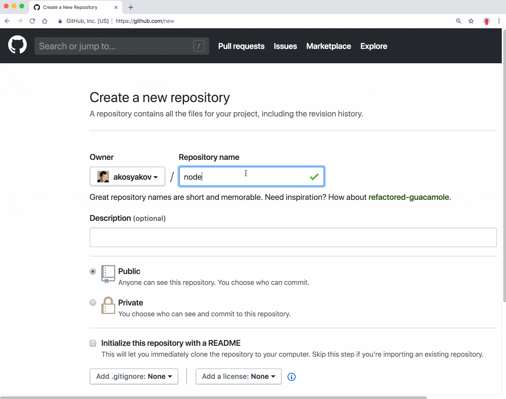
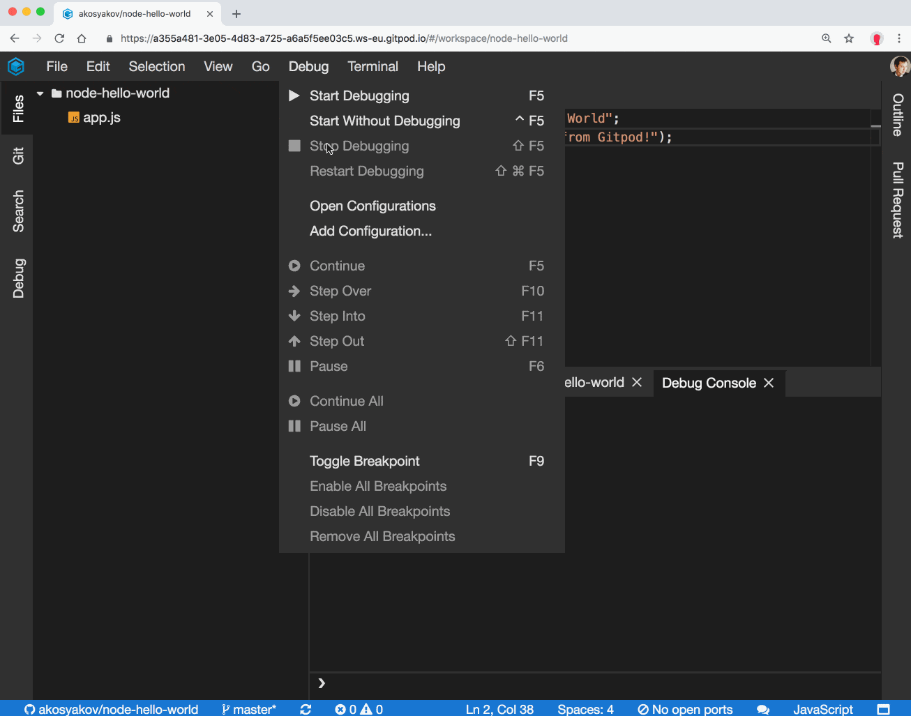
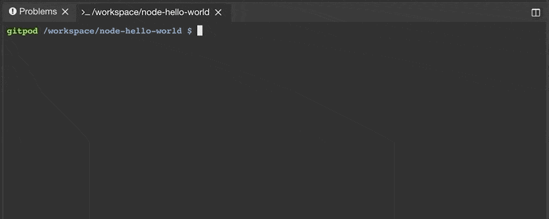
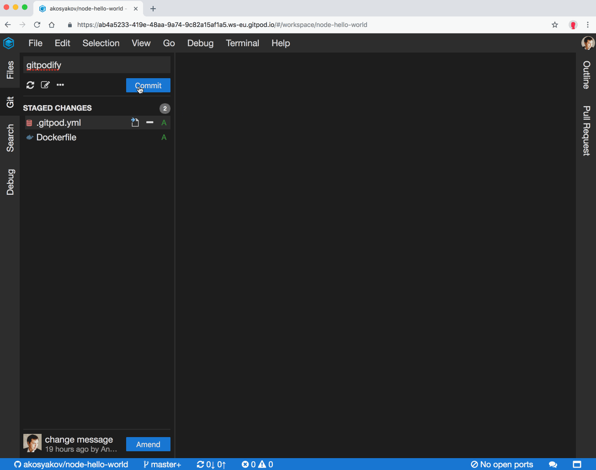
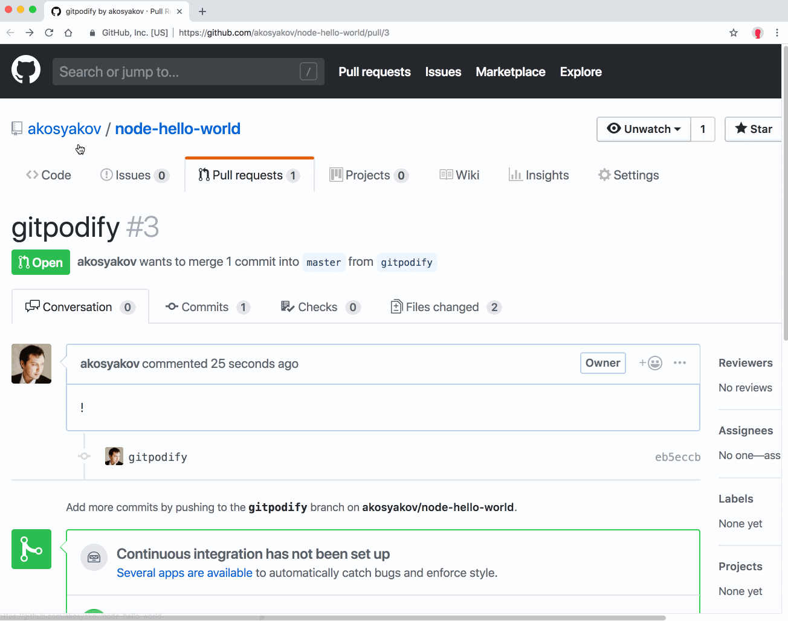
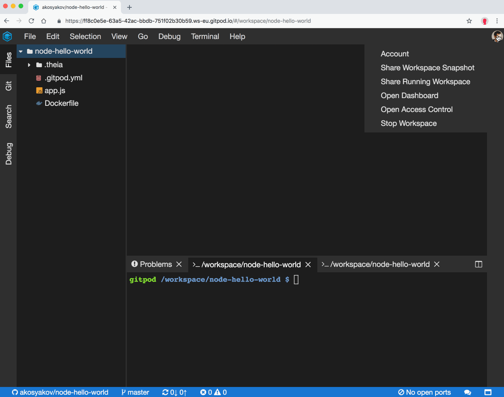
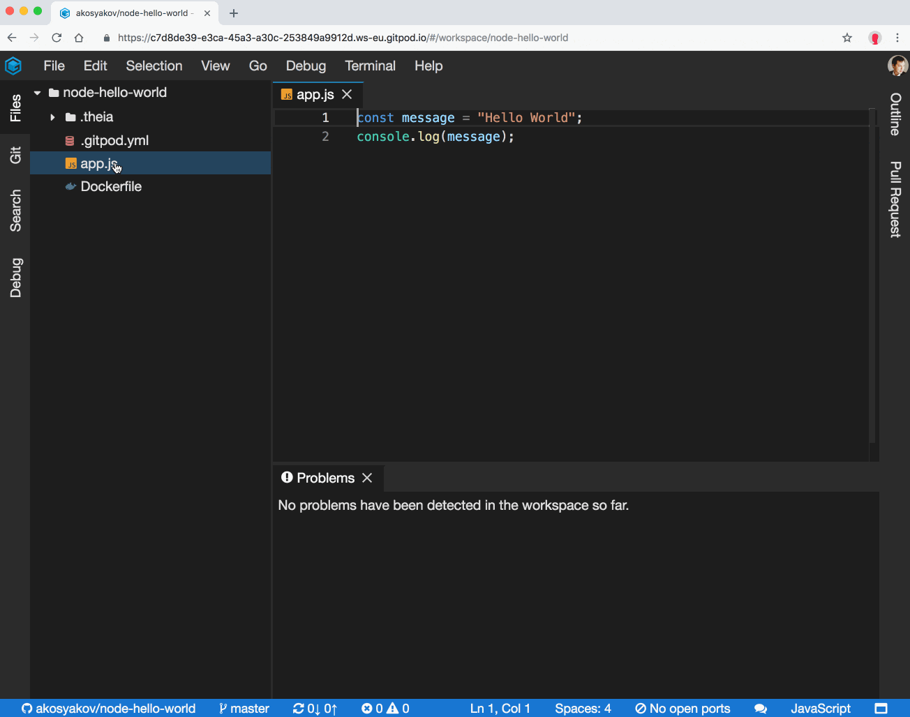

Nowadays, there are many collaborative platforms for showcasing JS code snippets and frameworks. Most of them run in your browser, some even manage to magically run Node.js applications in the cloud. They abstract away many possibilities in order to focus on prototyping and learning.

This simplification (or even magic) eventually turns out to be a hard wall. Once we leave the prototype stage, we need to be able to control and freely combine different versions of frontend and Node.js frameworks, connect to the database that best fits our use case, use different JS flavors and deployment services.

In this blog post, I will show you a transparent way of getting started with Node.js easily without the magic. The approach taken provides a low entry barrier without the wall once you grow out of it. You will learn how to write Node.js applications in a browser-based environment, that has all the depth of a full local dev environment with VS Code but the friendly onboarding of JSFiddle. These environments can be freely shared to work together and showcase your applications.

The dev environment is called [Gitpod](https://www.gitpod.io/) and is entirely free for open-source development.

<h2 class="h3">Table of Contents</h2>

- [Hello World](#hello-world)

- [Automating Node.js setup](#automating-nodejs-setup)

- [Working with Pull Requests](#working-with-pull-requests)

- [Working Together](#working-together)

- [Developing full-stack Node.js applications](#developing-full-stack-nodejs-applications)

- [Summary](#summary)

## Hello World

Let’s get started by developing a simple “Hello World” application and learning the basics of Node.js development.

### Start a new project

Gitpod treats any GitHub repository as a project which can be opened. Let’s start by creating a new repository for our Hello World project:

- open your GitHub dashboard and select New Repository;

- enter a repository name and click Create repository.

Now, we can open the created project in Gitpod. You can do it by simply prefixing the repository URL with gitpod.io/#. For example, I’ve called my repository node-hello-world and it can be opened in Gitpod with **gitpod.io/#**https://github.com/akosyakov/node-hello-world.

The first time, you will need to sign in Gitpod with your GitHub account. GitHub will ask you to authorize read access to your email address. Write access to repositories can be granted later on [your access control page](https://gitpod.io/access-control/).


Gitpod starts a new workspace, which is a Linux-based cloud container, and provides access to it via a VS Code powered online IDE. Workspaces are started on demand and automatically shut-down if you don’t use them. They are continuously replicated and never deleted, so you always can restart a workspace later from [your Gitpod dashboard](https://gitpod.io/workspaces/).



_If you don’t want to create a new project from scratch, click on [a snapshot link](https://gitpod.io/#snapshot/0d82ae08-c328-4cb5-96e5-7233d5de0c11) of my workspace to try Hello World application. I will cover later how one can make a workspace snapshot._

### Writing a Node.js application

By default, each workspace is preconfigured with standard tools like Node.js, npm, yarn and nvm. Later we will learn how to change the Node.js setup. Now, let’s code something and run it:

- open the command palette (F1) and select New File command;

- create a new file with app.js name and type the following content:

  const message = 'Hello World';

  console.log(message, 'from Gitpod!');

_As you type, you can see that Gitpod validates your code. It also provides you with smart completions and documentation on hover._

### Run / Debug a Node.js application

In order to run the application, type node app.js into the terminal.


Of course, you can have more than one terminal to your cloud workspace.

Next up, let’s see how we can debug the application:

- create a debug configuration (Debug-> Add Configuration) and select Node.js: Launch Program configuration snippet in the content assist of the opened editor;

- add a breakpoint into app.js file, by clicking on the gutter on the left;

- open the Debug View (View -> Debug),

- press the green play icon to start debugging (or press F5).

Our program should run, and when a breakpoint hits you can inspect call stack, variables and even use the debug console to evaluate expressions.



### Working with Git

Let’s have a look at how we can share our changes through Git. Open the Git view, stage your changes, enter a commit message and click commit. You can also open a diff editor by clicking on changed files and push new commits to GitHub with Git: Push... command.


If you have not granted write access to your repositories yet, Gitpod will ask for it. Grant permissions and try to push again.


## Automating Node.js setup

As mentioned above each workspace by default is preconfigured with standard tools, like Node.js 8.x.

Let’s assume that we agreed on using Node.js 10.x for our project instead. Usually, all developers have to update their local Node.js versions and often switch between them depending on what project or branch is used.

With Gitpod, it is different. You can configure a workspace with a specific Node.js version for each branch via Docker images, without changing the local setup for any developer at all.

The easiest way to initialize the config is to use Gitpod’s CLI. The CLI will walk you through the most important configuration options and create a .gitpod.yml file that is located in the root of your repository.

In the terminal type gp init.

1. For the first option choose: docker file. It will create a Dockerfile that sits next to .gitpod.yml. Here you can add any kind of tools and dependencies you will need for development. When starting a fresh workspace, Gitpod will pick that Dockerfile up and provide a cloud container based on that.

1. Now press enter until the tasks section. Type node app.js. The tasks are automatically started whenever a workspace gets started. You can have multiple tasks and use different lifecycles. Each task will be opened in a separate terminal.



The created files will be automatically opened in the editor. Let’s change the config so that it starts two tasks in separate terminals:

```
image:

  file: Dockerfile

tasks:

  - init: node --version

  - command: node app.js
```

And change the Dockerfile to use Node.js 10.x as the base image:

    FROM node:10

To try it our we need to push the config back to GitHub and open a new workspace. Let’s do this through a pull request, so we learn about the GitHub integration on the way.

_Here is [another snapshot link](https://gitpod.io/#snapshot/ea0d6704-a513-4c94-b8e7-fe72c3d8e5fb) to try our configuration without opening a pull request. You can learn more about workspace configuration [here](https://www.gitpod.io/docs/configuration/)._

## Working with Pull Requests

Gitpod provides seamless integration with GitHub features like creating and reviewing pull requests.

### Creating a new Pull Request

Let’s open a new pull request from Gitpod:

- commit your changes using the Git view (see above);

- use Git: Checkout command or click the branch item in the status bar to create a new branch. Name it somehow, e.g. gitpodify;

- next up open the Pull Request view on the right. You cannot create a new pull request yet, because first the new branch should be published to GitHub, click publish changes;

- after that, the Pull Request view will be updated and you can open a new pull request.



### Reviewing a Pull Request

As I’ve mentioned at the beginning Gitpod treats each GitHub repository as a project. Actually, it is even smarter and can figure out from any GitHub URL which branch should be opened and how.

Let’s go to the pull request page on GitHub and prefix its URL with gitpod.io/#, just like we did initially:

_Opening a PR with new workspace image can take some time since Gitpod needs to build the image. But it is only rebuilt when changed._

As you can see, Gitpod opens with a branch for your pull request. PR file changes are presented on the left sidebar to review. Our init and command workspace tasks are executed in terminals, Node.js is 10.x now, and Hello World is printed.

While reviewing in Gitpod, you can comment, change the code to address comments, suggest new changes, etc. When you are done, merge your pull request from Gitpod as well.


## Working Together

Since Gitpod workspaces are running in the cloud, we can share them in similar ways how you share documents in Google Docs.

### Helping others with Node.js development

You can share your running workspaces with colleagues to collaborate on exactly the same codebase, development tools, running terminals, and applications. It is particularly useful to assist each other on some tricky configuration, dependency or code problem.

In order to share a running workspace: click on your account avatar, select Share Running Workspace, enable sharing, copy a link and share the copied link with your colleagues.

_Both users use exactly the same workspace and see the shared output in terminals._

### Showcasing Node.js applications

You can take a complete snapshot (clone) of your workspace, even including your IDE layout, and share it as a link. Think about workspace snapshots like code snippets on JSFiddle. It is useful in the same way: to share reproducible examples on issues, Stack Overflow answers, for tutorials and workshops. But at the same, you share the complete development setup and present it in the appropriate way.

In order to share a workspace snapshot: click on your account avatar, select Share Workspace Snapshot, copy a link and share the copied link where you want.

_The [shared workspace snapshot](https://gitpod.io/#snapshot/14dc69f1-0e8c-4a36-b221-0ab16e91326e) preserves not only the development setup but the IDE layout and even selection in the editor._

## Developing full-stack Node.js applications

So far, we’ve only had a look at a simple Node.js application. In case you wonder whether it will scale to sophisticated applications you can try any of the following repositories:

- [Node.js Shopping Cart](https://github.com/gitpod-io/nodejs-shopping-cart) is a reference Node.js application demonstrating how to use the Express framework. You can open it in Gitpod with [one-click](https://gitpod.io/#https://github.com/gitpod-io/nodejs-shopping-cart) and follow along [this blog post](https://medium.com/gitpod/debugging-node-js-applications-in-theia-76c94c76f0a1) explaining in details how to debug the app.

- Gitpod is based on an open-source IDE framework — [Theia](http://theia-ide.org). It’s built with a lot of JS technologies, including Node.js, Express, TypeScript and React. And, of course, [Gitpod is used to develop Theia](https://github.com/theia-ide/theia/blob/master/doc/Developing.md#run-the-browser-example-with-gitpod).

- You even can develop Electron applications in Gitpod, like VS Code. Chris demonstrates it in [this blog post](https://medium.com/gitpod/developing-native-ui-applications-in-gitpod-15af2967c24e).

## Summary

Gitpod provides the complete Node.js development experience right from a browser. It enables you to automate your development setup, quickly onboard developers, streamline code review and testing processes on GitHub, help each other in real time, showcase your applications and setups. Also, it is entirely free for open source development!

If you have any questions, [join the Gitpod Community](https://community.gitpod.io/)! We are listening intensely to all feedback.
