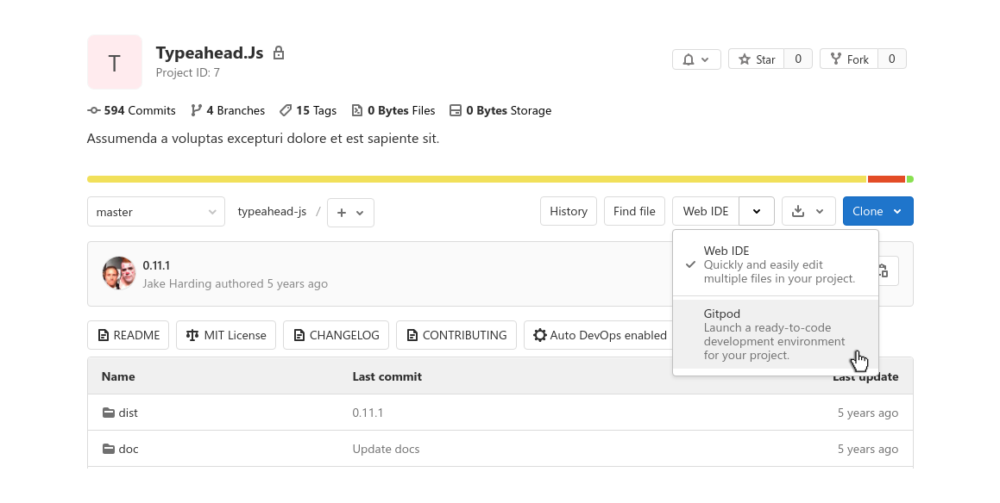

# GitLab Integration

GitLab comes with a [native Gitpod integration](https://docs.gitlab.com/ce/integration/gitpod.html). This feature is enabled on GitLab.com by default, but needs to be enabled by the administrator of a GitLab self-managed instance as described in the [GitLab docs](https://docs.gitlab.com/ce/integration/gitpod.html).

## Starting Workspaces

When the Gitpod integration is enabled in GitLab, users can choose to start a Gitpod workspace as an alternative to the GitLab Web IDE directly from GitLab. Simply click on the dropdown arrow next to the `Web IDE` split button on the project or merge request page, and choose “Gitpod”. The Gitpod workspace will open in a new browser tab. Then, the next time you visit a GitLab page, the last used action will be pre-selected.

To launch new Gitpod workspaces for issues, branches, specific commits, etc. you can also prefix any GitLab URL with `gitpod.io/#` as described in the [Getting Started](/docs/getting-started) page, or use the [browser extension](/docs/browser-extension/) to add a convenient Gitpod button to every GitLab page.

## Enabling Prebuilds

To enable [prebuilt workspaces](/docs/prebuilds/) for your GitLab project you need to grant `allow api calls` in Gitpod's [Access Control](https://gitpod.io/access-control/) page. This allows Gitpod to install a webhook. The webhook creates a new prebuild for every push event.

The webhook will be automatically installed when you trigger the first prebuild manually. For this, prefix your GitLab project URL with `gitpod.io/#prebuild/` as described in the [prebuilds page](/docs/prebuilds/#on-gitlab-and-bitbucket).

## OAuth Application

In Gitpod you can register your own GitLab OAuth application. This allows to use Gitpod with any GitLab instance.

Here's how to do that:

1. Head over to [the settings](https://gitpod.io/settings/) and scroll to the section about `Git Provider`.

2. In the pop-up you choose GitLab as the type and type the host URL of the GitLab installation you want to use. If you want to hook up with the gitlab.com you can use that host as well, of course.

3. The form for your GitLab integration now shows three values. The first one is the redirect URL, that you need to register on the GitLab side. Copy the redirect Url to your clipboard

4. Go to /profile/applications on your GitLab installation to create an OAuth App. Type in a name (e.g. Gitpod) and paste the Redirect URL in the corresponding text area. Check the scopes `api` and `read_user`. Click the button "Save Application" below.

5. Copy the `Application ID` and the `Secret` in the corresponding form fields (`Client ID` resp. `Client Secret`) of your Gitpod installation.

6. Press `Connect` and go through the Auth flow the first time.

Congrats you have setup the GitLab integration. 🎉

Next up you should install the browser extension and [configure it with your Gitpod installation URL](/docs/browser-extension/#use-with-gitpod-self-hosted).
